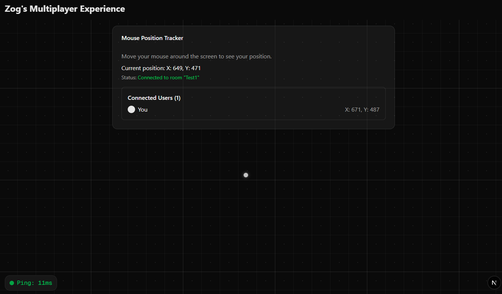

# Supabase Realtime Multiplayer Mouse Tracker

A real-time multiplayer application that tracks and displays mouse positions of all connected users. This project demonstrates how to build interactive multiplayer experiences using Supabase's Realtime functionality.

*Inspired by [multiplayer.dev](https://multiplayer.dev) provided by Supabase.*

https://supabase-realtime-multiplayer.vercel.app/ (Supabase sources are offline - thats just deployment test)


## Features

- 🖱️ Real-time mouse position tracking
- 👥 See all connected users
- ⚡ Ping measurement system
- 🎯 Smooth cursor animation with trail effects (can be increased later on but make sure to check message counts)
- 🔄 Automatic synchronization across clients

## How It Works

This application leverages Supabase's Realtime functionality to create a shared space where multiple users can interact:

1. When a user connects, they join a fixed room called "Test1"
2. User presence is tracked using Supabase Presence
3. Mouse movements are broadcast to all connected clients
4. Each client receives updates and renders all cursors with smooth interpolation
5. A ping system measures connection quality in real-time

## Getting Started

### Prerequisites

- [Bun](https://bun.sh/) (preferred) or Node.js
- A Supabase account and project with Realtime enabled

### Setup

1. Clone the repository:
   ```bash
   git clone https://github.com/zog06/supabase-realtime-multiplayer.git
   cd supabase-realtime-multiplayer
   ```

2. Install dependencies:
   ```bash
   bun install
   ```

3. Create a `.env.local` file with your Supabase credentials:
   ```
   NEXT_PUBLIC_SUPABASE_URL=your-supabase-url
   NEXT_PUBLIC_SUPABASE_ANON_KEY=your-supabase-anon-key
   ```

4. Start the development server:
   ```bash
   bun dev
   ```

5. Open [http://localhost:3000](http://localhost:3000) in your browser

6. Deploy project into any CDN provider (in this one I preferred Vercel)
## Supabase Configuration (if have any problem can solve)

For this project to work, you need to enable Realtime functionality in your Supabase project:

1. Go to your Supabase dashboard
2. Navigate to Database → Realtime
3. Enable "Broadcast" and "Presence" features
4. Add the room channel pattern `room:*` to the allowed list

## License

MIT

## Acknowledgements

- Inspired by [multiplayer.dev](https://multiplayer.dev) from Supabase
- Built with [Next.js](https://nextjs.org/) and [Supabase](https://supabase.io/)
